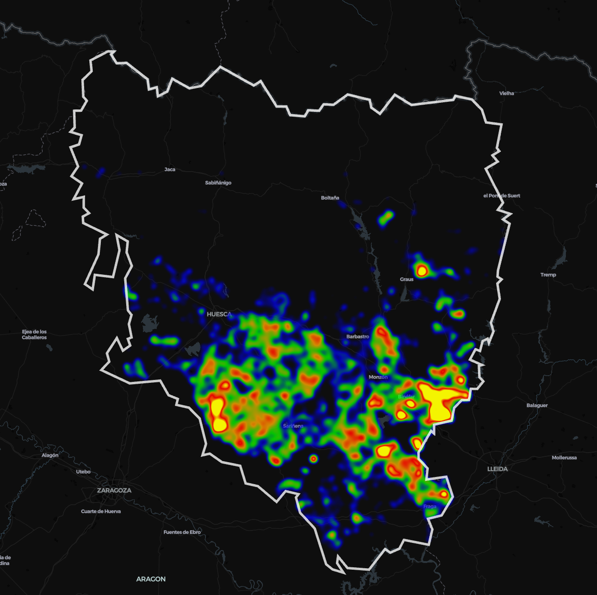
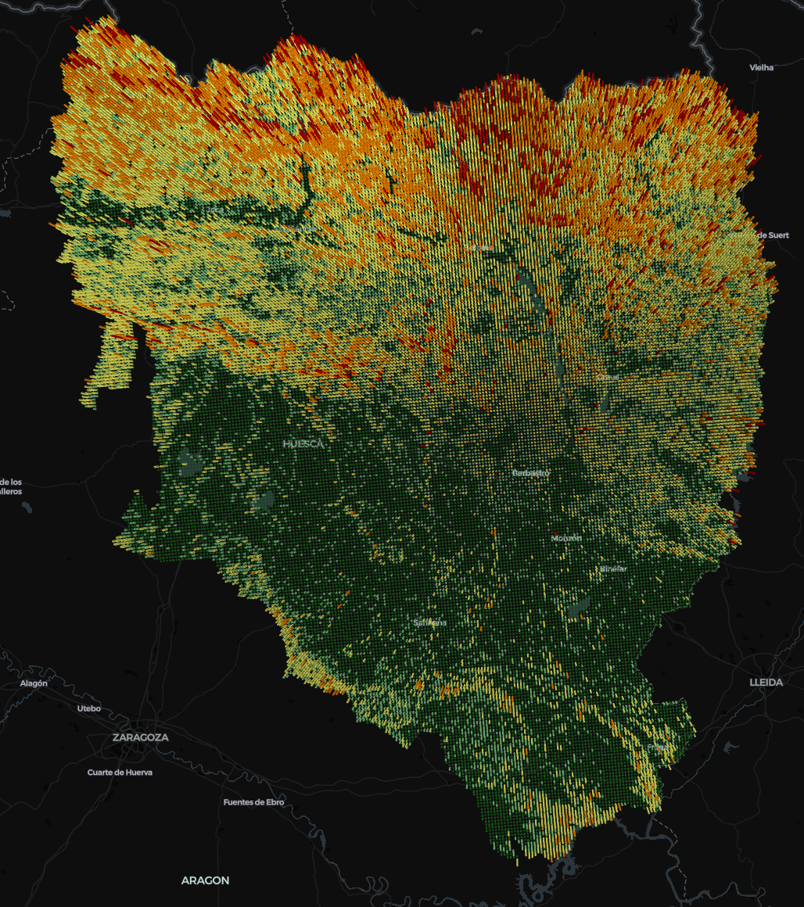
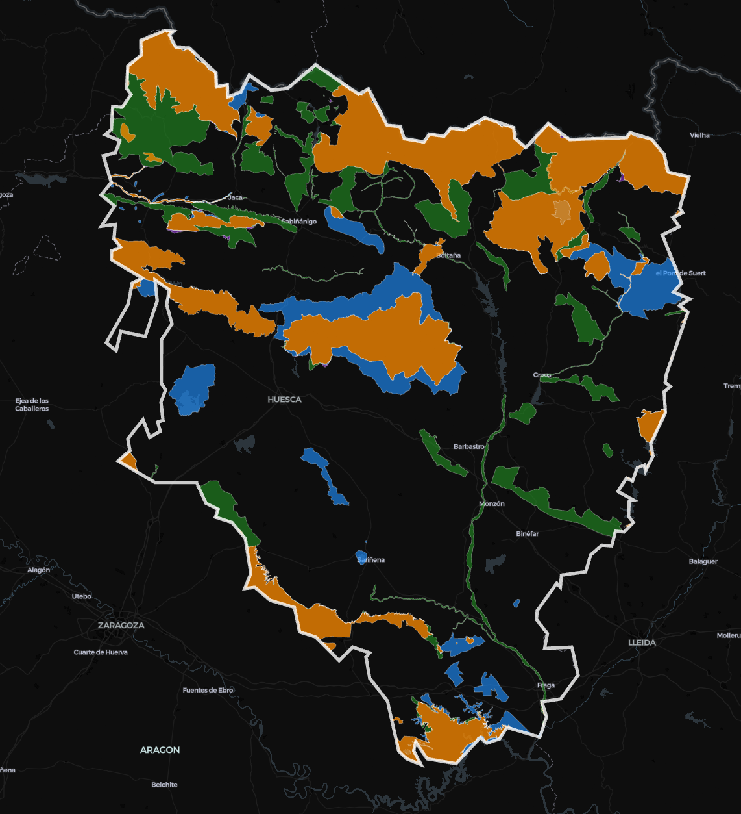
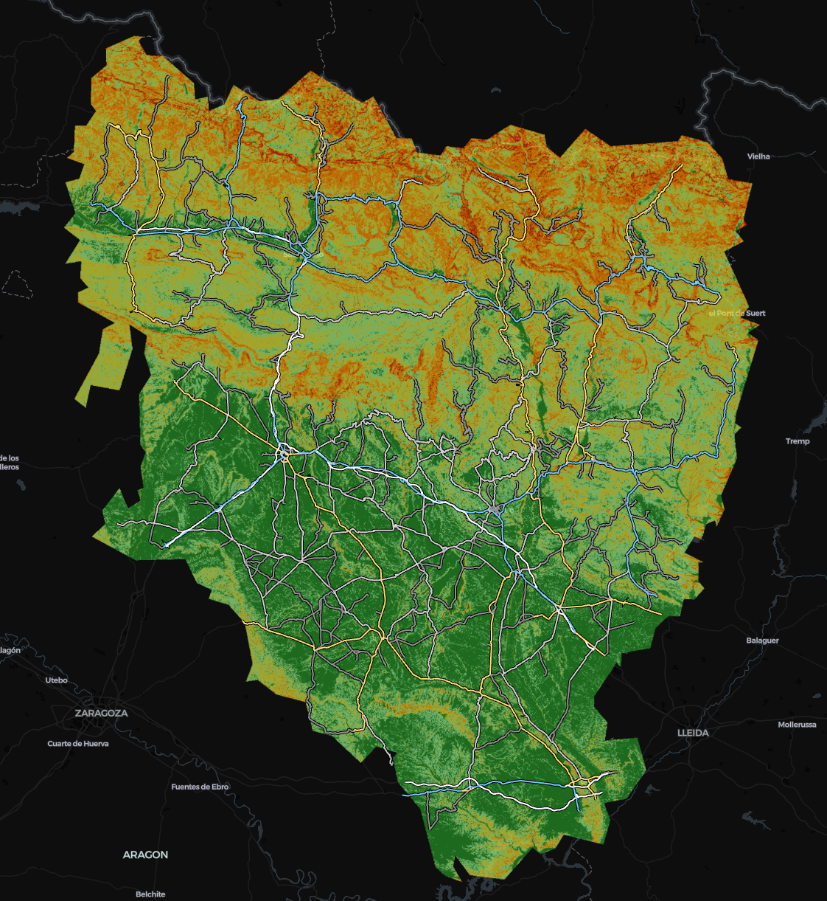
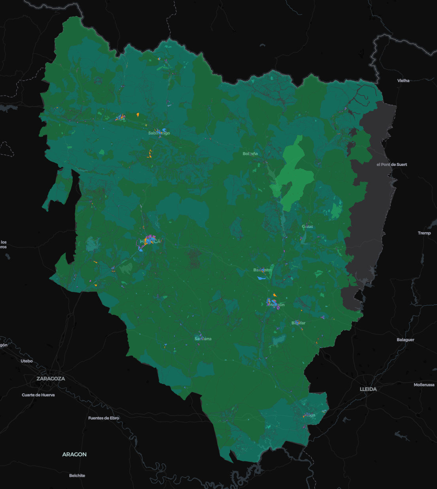
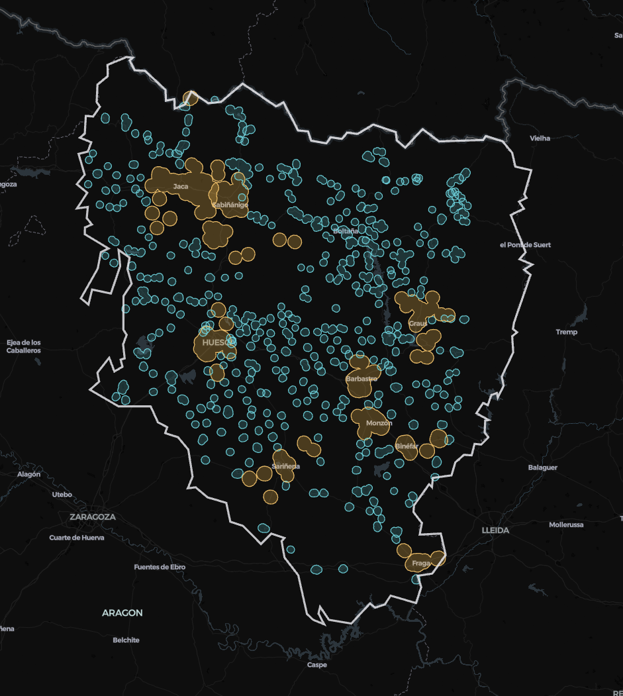

# Análisis de Idoneidad — Planta de Biometano (Huesca)

Pipeline de análisis geoespacial (descarga de datos, procesado, scoring, clustering y viabilidad) que alimenta el [mapa interactivo](https://babylonfushi.github.io/biomethane_map/).

**Las tres preguntas que responde:**

1. ¿Dónde conviene poner una planta de biometano a partir de purín porcino?
2. ¿La materia prima seguirá estando dentro de 15 años?
3. ¿Qué probabilidad hay de ganar (o perder) dinero?

**CRS:** todo lo vectorial se reproyecta a **EPSG:25830** (UTM 30N) para medir distancias en metros;
el mapa final usa EPSG:4326.

## Fases del proyecto

El pipeline se organiza en tres partes, de 63.612 celdas de 500 m a una recomendación de inversión:

| | Parte 1 — Geoespacial | Parte 2 — Selección | Parte 3 — Financiera |
|---|---|---|---|
| **Pregunta** | ¿Dónde se puede? | ¿Dónde conviene y seguirá habiendo purín? | ¿Se gana dinero y con qué probabilidad? |
| **Método** | Malla 500 m, 6 capas, exclusiones + scoring + K-Means | Proyección del censo + economía preliminar + Random Forest | Monte Carlo 25.000 sim. × 3 escalas, DCF a 15 años |
| **Entra → Sale** | 63.612 → **2.890 viables** | 2.890 → **209 óptimas** | 209 → **ranking + recomendación** |
| **Resultado** | Mapa de idoneidad | Drivers: biomasa 10 km + gasoducto | Celda 13806 · Grande · P(VAN>0)=76,9 % |

**Parte 1 — Idoneidad geoespacial** (`01_download/` + `02_analysis/idoneidad_scoring_clustering.ipynb`):
sobre la provincia se tiende una malla de 63.612 celdas de 500×500 m y se cruzan seis capas (biomasa
porcina, gasoducto, carretera, pendiente, suelo y Red Natura 2000). Exclusiones duras + score
ponderado + K-Means (k=7) descriptivo dejan 2.890 celdas viables.

Los pesos del score se obtuvieron mediante una **matriz AHP** (Proceso Analítico Jerárquico), con un
ratio de consistencia **CR = 0,0000 (OK, consistente)**:

| Variable | Peso |
|---|---|
| Biomasa porcina | 0,2927 |
| Gasoducto | 0,2927 |
| Clasificación del suelo | 0,1463 |
| Categoría de carretera | 0,0976 |
| Pendiente | 0,0732 |
| Distancia a carretera | 0,0488 |
| Distancia a núcleos | 0,0488 |

**Parte 2 — Proyección del censo y celdas óptimas** (`03_viability/`, primera etapa): proyección del
censo porcino a 2040 (regresión lineal, MAPE ≈ 1,6 %), economía preliminar celda a celda y modelos
Random Forest de apoyo. Un filtro triple (stock proyectado, distancia a gasoducto, margen anual) deja
209 celdas óptimas.

**Parte 3 — Viabilidad económica (Monte Carlo)** (`03_viability/`, segunda etapa): 25.000 simulaciones
por localización sobre un modelo de flujos de caja descontados a 15 años, con 3 escalas de planta,
CAPEX no fijo y curva de arranque. Salida: distribución de VAN y P(VAN>0) por celda. Mejor resultado:
celda 13806, escala Grande, P(VAN>0) = 76,9 %.

> **Por qué (casi) todas las plantas salen Grande:** no es un fallo del modelo, es **apalancamiento
> operativo**. El OPEX fijo (personal, seguros, administración, digestato) es casi el mismo produzca
> la planta 2 o 10 millones de Nm³, pero los ingresos sí escalan — a lo que se suma un CAPEX específico
> decreciente (2,00 €/Nm³ la pequeña frente a 1,50 la grande). Invertir en pequeño es doblemente
> ineficiente.

La app narrativa en Streamlit recorre todo el trabajo, del contexto del censo a la recomendación de
inversión, en 8 secciones:

| Sección | La pregunta que responde |
|---|---|
| 0 · Los datos de Huesca | Las seis capas descargadas sobre la delimitación provincial |
| 1 · El punto de partida | ¿Por qué purín, por qué España, por qué Huesca? |
| 2 · Idoneidad geoespacial | De 63.612 celdas a 2.890 viables: exclusiones, score y mapa |
| 3 · Proyección 2040 | ¿Seguirá habiendo purín? Forecasting del censo |
| 4 · Economía y celdas óptimas | Cuenta de resultados celda a celda + filtro triple |
| 5 · Monte Carlo | 25.000 futuros por sitio: la distribución del VAN |
| 6 · Sensibilidad y break-even | Qué variable manda y a qué precio empieza a ganar |
| 7 · Conclusiones | Ranking final, recomendación y fuentes |

## Estructura

```
data/
├── processed/                    Grid procesado, Top 10, capas intermedias
└── raw/                          Salidas de los notebooks de descarga, una subcarpeta por notebook
    ├── 01_ganado_porcino/         EFECTIVOS_GANADO - data.csv y PORCINO.csv (datos de partida) + keep.txt, granjas_porcino_huesca.gpkg, clasificacion_porcino.gpkg, kde_porcino_huesca.tif (generados)
    ├── 02_gasoductos/             gasoductos_huesca.gpkg
    ├── 03_pendiente_dem/          pendiente_huesca_provincia.tif
    ├── 04_red_natura2000/         red_natura_huesca.gpkg
    ├── 05_red_viaria/             carreteras_camiones_huesca.gpkg
    ├── 06_clasificacion_suelo/    clasificacion_suelo_huesca.gpkg
    └── delimitations/             Huesca_Delimitacion.geojson y .qmd

docs/
├── index.html                    Página del mapa interactivo (GitHub Pages)
└── map/                           Mapas HTML/PNG generados por cada notebook, misma subcarpeta por notebook
    ├── 01_ganado_porcino/
    ├── 02_gasoductos/
    ├── 03_pendiente_dem/
    ├── 04_red_natura2000/
    ├── 05_red_viaria/
    ├── 06_clasificacion_suelo/
    └── idoneidad_scoring_clustering/

notebooks/
├── 01_download/                  Descarga de las capas base
│   ├── 01_ganado_porcino.ipynb
│   ├── 02_gasoductos.ipynb
│   ├── 03_pendiente_dem.ipynb
│   ├── 04_red_natura2000.ipynb
│   ├── 05_red_viaria.ipynb
│   └── 06_clasificacion_suelo.ipynb
├── 02_analysis/                  Grid 500x500m, scoring, K-Means y mapa final
│   └── idoneidad_scoring_clustering.ipynb
└── 03_viability/                 Viabilidad económica del Top 10
    └── TFM_viabilidad_economica_Fl....ipynb

streamlit_app/                    Aplicación de presentación del proyecto
├── __pycache__/
├── pages/
├── Home.py
├── requirements.txt
└── utils.py

README.md
requirements.txt
```

## 🗺️ Mapas secundarios

Además del mapa de idoneidad final, cada notebook de descarga genera su propio mapa interactivo de validación, publicado en [GitHub Pages](https://babylonfushi.github.io/Biomethane-Plant-Design/). Son mapas secundarios pero igual de útiles para auditar cada capa por separado — aquí una vista previa de cada uno, con enlace para explorarlos a profundidad:

<table>
<tr>
<td width="50%">

**🐖 Ganado porcino**
<br>Densidad KDE de la cabaña porcina ponderada por capacidad de granja.
<br>
<br>[▶ Ver mapa interactivo](https://babylonfushi.github.io/Biomethane-Plant-Design/map/01_ganado_porcino/mapa_porcino_heatmap.html)

</td>
<td width="50%">

**⛰️ Pendiente (DEM 3D)**
<br>Relieve del terreno en 3D a partir del MDT de 5 m del IGN.
<br>
<br>[▶ Ver mapa interactivo](https://babylonfushi.github.io/Biomethane-Plant-Design/map/03_pendiente_dem/mapa_pendiente_3d_huesca.html)

</td>
</tr>
<tr>
<td width="50%">

**🌳 Red Natura 2000**
<br>Espacios protegidos (ZEC/ZEPA) que actúan como exclusión dura.
<br>
<br>[▶ Ver mapa interactivo](https://babylonfushi.github.io/Biomethane-Plant-Design/map/04_red_natura2000/mapa_red_natura.html)

</td>
<td width="50%">

**🛣️ Red viaria**
<br>Carreteras aptas para camiones, combinadas con la pendiente del terreno.
<br>
<br>[▶ Ver mapa interactivo](https://babylonfushi.github.io/Biomethane-Plant-Design/map/05_red_viaria/mapa_pendiente_carreteras_huesca.html)

</td>
</tr>
<tr>
<td width="50%">

**🏗️ Clasificación del suelo**
<br>Categorías urbanísticas (urbano, urbanizable, no urbanizable).
<br>
<br>[▶ Ver mapa interactivo](https://babylonfushi.github.io/Biomethane-Plant-Design/map/06_clasificacion_suelo/mapa_clasificacion_huesca.html)

</td>
<td width="50%">

**🏘️ Buffer núcleos de población**
<br>Zonas de exclusión alrededor de los núcleos urbanos (INE).
<br>
<br>[▶ Ver mapa interactivo](https://babylonfushi.github.io/Biomethane-Plant-Design/map/06_clasificacion_suelo/mapa_buffer_poblacion_huesca.html)

</td>
</tr>
</table>

> **Nota:** las rutas de imagen asumen que cada `.html` de `docs/map/` tiene su `.png` equivalente en la misma carpeta (tal como indica la estructura del repo). Si el nombre de archivo del PNG difiere del `.html`, ajusta la ruta correspondiente.

## Pendiente de limpieza

**Resuelto:**
- ~~`01_ganado_porcino`: sustituir rutas absolutas~~
- ~~`02_gasoductos`: sustituir rutas absolutas (`C:/Users/...`) por rutas relativas a `data/`~~
- ~~`03_pendiente_dem`: separar celdas de diagnóstico/exploración del flujo final de descarga~~
- ~~`04_red_natura2000`: sustituir rutas absolutas~~
- ~~`05_red_viaria`: eliminar celda con output de error (kernel crash)~~
- ~~`06_clasificacion_suelo`: sustituir rutas absolutas~~
- ~~`idoneidad_scoring_clustering`: sustituir ruta absoluta en la celda del mapa final~~
- ~~`06_clasificacion_suelo`: exportar `buffer_nucleos_urbanos.gpkg` a `data/raw/06_clasificacion_suelo/`~~
- ~~`requirements.txt` / `environment.yml` definitivo (raíz y `streamlit_app/`)~~
- ~~Documentar `streamlit_app/` (páginas de la presentación, dependencias entre `Home.py`, `utils.py` y `pages/`)~~

## Tecnologías

- GeoPandas, Shapely, PyProj — procesado vectorial
- Rasterio, rasterstats — procesado raster (pendiente/DEM)
- OSMnx — descarga de red viaria
- scikit-learn, statsmodels — clustering K-Means y análisis VIF
- pydeck — generación del mapa interactivo
- Streamlit — aplicación de presentación del proyecto (`streamlit_app/`)
- Optuna — optimización de hiperparámetros
- numpy / numpy-financial — motor Monte Carlo y flujos de caja (VAN, TIR)
- Folium, Plotly — visualización adicional

---

*Repositorio asociado al [mapa de idoneidad](https://github.com/babylonfushi/biomethane_map).*

*Equipo: Rafael Sánchez · Bruno Olgatti · Fernando Gonella.*

---


# Suitability Analysis — Biomethane Plant (Huesca)

Geospatial analysis pipeline (data download, processing, scoring, clustering and viability) that feeds the [interactive map](https://babylonfushi.github.io/biomethane_map/).

**The three questions it answers:**

1. Where is it worth placing a biomethane plant based on pig slurry?
2. Will the feedstock still be there in 15 years?
3. What is the probability of making (or losing) money?

**CRS:** all vector layers are reprojected to **EPSG:25830** (UTM 30N) to measure distances in
meters; the final map uses EPSG:4326.

## Project Phases

The pipeline is organized into three parts, from 63,612 cells of 500 m to an investment recommendation:

| | Part 1 — Geospatial | Part 2 — Selection | Part 3 — Financial |
|---|---|---|---|
| **Question** | Where is it possible? | Where is it worthwhile, and will there still be slurry? | Does it make money, and with what probability? |
| **Method** | 500 m grid, 6 layers, exclusions + scoring + K-Means | Census projection + preliminary economics + Random Forest | Monte Carlo, 25,000 sims × 3 scales, 15-year DCF |
| **In → Out** | 63,612 → **2,890 viable** | 2,890 → **209 optimal** | 209 → **ranking + recommendation** |
| **Result** | Suitability map | Drivers: biomass within 10 km + gas pipeline | Cell 13806 · Large · P(NPV>0)=76.9% |

**Part 1 — Geospatial suitability** (`01_download/` + `02_analysis/idoneidad_scoring_clustering.ipynb`):
a 500×500 m grid is laid over the province and six layers are intersected with it (pig biomass, gas
pipeline, road network, slope, soil classification and Natura 2000 network). Hard exclusions +
weighted score + descriptive K-Means (k=7) leave 2,890 viable cells.

The score weights were obtained using an **AHP matrix** (Analytic Hierarchy Process), with a
consistency ratio of **CR = 0.0000 (OK, consistent)**:

| Variable | Weight |
|---|---|
| Pig biomass | 0.2927 |
| Gas pipeline | 0.2927 |
| Soil classification | 0.1463 |
| Road category | 0.0976 |
| Slope | 0.0732 |
| Distance to road | 0.0488 |
| Distance to settlements | 0.0488 |

**Part 2 — Census projection and optimal cells** (`03_viability/`, first stage): pig census projection
to 2040 (linear regression, MAPE ≈ 1.6%), cell-by-cell preliminary economics and supporting Random
Forest models. A triple filter (projected stock, distance to pipeline, annual margin) leaves 209
optimal cells.

**Part 3 — Economic viability (Monte Carlo)** (`03_viability/`, second stage): 25,000 simulations per
location on a 15-year discounted cash flow model, with 3 plant scales, variable CAPEX and a ramp-up
curve. Output: a NPV distribution and P(NPV>0) per cell. Best result: cell 13806, Large scale,
P(NPV>0) = 76.9%.

> **Why (almost) every plant comes out Large:** it's not a model flaw, it's **operating leverage**.
> Fixed OPEX (staff, insurance, admin, digestate) is nearly the same whether the plant produces 2 or
> 10 million Nm³, but revenue does scale — on top of a decreasing specific CAPEX (€2.00/Nm³ for the
> small plant vs. €1.50 for the large one). Investing small is doubly inefficient.

The narrative Streamlit app walks through the whole project, from census context to the investment
recommendation, in 8 sections:

| Section | Question it answers |
|---|---|
| 0 · Huesca's data | The six layers downloaded over the provincial boundary |
| 1 · The starting point | Why slurry, why Spain, why Huesca? |
| 2 · Geospatial suitability | From 63,612 cells to 2,890 viable: exclusions, score and map |
| 3 · 2040 projection | Will there still be slurry? Census forecasting |
| 4 · Economics and optimal cells | Cell-by-cell P&L + triple filter |
| 5 · Monte Carlo | 25,000 futures per site: the NPV distribution |
| 6 · Sensitivity and break-even | Which variable drives it, and at what price it turns profitable |
| 7 · Conclusions | Final ranking, recommendation and sources |

## Structure

```
data/
├── processed/                    Processed grid, Top 10, intermediate layers
└── raw/                          Outputs of the download notebooks, one subfolder per notebook
    ├── 01_ganado_porcino/         EFECTIVOS_GANADO - data.csv and PORCINO.csv (source data) + keep.txt, granjas_porcino_huesca.gpkg, clasificacion_porcino.gpkg, kde_porcino_huesca.tif (generated)
    ├── 02_gasoductos/             gasoductos_huesca.gpkg
    ├── 03_pendiente_dem/          pendiente_huesca_provincia.tif
    ├── 04_red_natura2000/         red_natura_huesca.gpkg
    ├── 05_red_viaria/             carreteras_camiones_huesca.gpkg
    ├── 06_clasificacion_suelo/    clasificacion_suelo_huesca.gpkg
    └── delimitations/             Huesca_Delimitacion.geojson and .qmd

docs/
├── index.html                    Interactive map page (GitHub Pages)
└── map/                           HTML/PNG maps generated by each notebook, same subfolder per notebook
    ├── 01_ganado_porcino/
    ├── 02_gasoductos/
    ├── 03_pendiente_dem/
    ├── 04_red_natura2000/
    ├── 05_red_viaria/
    ├── 06_clasificacion_suelo/
    └── idoneidad_scoring_clustering/

notebooks/
├── 01_download/                  Download of base layers
│   ├── 01_ganado_porcino.ipynb
│   ├── 02_gasoductos.ipynb
│   ├── 03_pendiente_dem.ipynb
│   ├── 04_red_natura2000.ipynb
│   ├── 05_red_viaria.ipynb
│   └── 06_clasificacion_suelo.ipynb
├── 02_analysis/                  500x500m grid, scoring, K-Means and final map
│   └── idoneidad_scoring_clustering.ipynb
└── 03_viability/                 Economic viability of the Top 10
    └── TFM_viabilidad_economica_Fl....ipynb

streamlit_app/                    Project presentation application
├── __pycache__/
├── pages/
├── Home.py
├── requirements.txt
└── utils.py

README.md
requirements.txt
```

**Interactive maps** (published on [GitHub Pages](https://babylonfushi.github.io/Biomethane-Plant-Design/), one per download notebook, except the suitability map):

- [Pig livestock](https://babylonfushi.github.io/Biomethane-Plant-Design/map/01_ganado_porcino/mapa_porcino_heatmap.html)
- [Slope (3D DEM)](https://babylonfushi.github.io/Biomethane-Plant-Design/map/03_pendiente_dem/mapa_pendiente_3d_huesca.html)
- [Natura 2000 network](https://babylonfushi.github.io/Biomethane-Plant-Design/map/04_red_natura2000/mapa_red_natura.html)
- [Road network](https://babylonfushi.github.io/Biomethane-Plant-Design/map/05_red_viaria/mapa_pendiente_carreteras_huesca.html)
- [Soil classification](https://babylonfushi.github.io/Biomethane-Plant-Design/map/06_clasificacion_suelo/mapa_clasificacion_huesca.html)
- [Settlement buffer](https://babylonfushi.github.io/Biomethane-Plant-Design/map/06_clasificacion_suelo/mapa_buffer_poblacion_huesca.html)

## Pending cleanup

**Resolved:**
- ~~`01_ganado_porcino`: replace absolute paths~~
- ~~`02_gasoductos`: replace absolute paths (`C:/Users/...`) with paths relative to `data/`~~
- ~~`03_pendiente_dem`: separate diagnostic/exploration cells from the final download flow~~
- ~~`04_red_natura2000`: replace absolute paths~~
- ~~`05_red_viaria`: remove cell with error output (kernel crash)~~
- ~~`06_clasificacion_suelo`: replace absolute paths~~
- ~~`idoneidad_scoring_clustering`: replace absolute path in the final map cell~~
- ~~`06_clasificacion_suelo`: export `buffer_nucleos_urbanos.gpkg` to `data/raw/06_clasificacion_suelo/`~~
- ~~Final `requirements.txt` / `environment.yml` (root and `streamlit_app/`)~~
- ~~Document `streamlit_app/` (presentation pages, dependencies between `Home.py`, `utils.py` and `pages/`)~~

## Technologies

- GeoPandas, Shapely, PyProj — vector processing
- Rasterio, rasterstats — raster processing (slope/DEM)
- OSMnx — road network download
- scikit-learn, statsmodels — K-Means clustering and VIF analysis
- pydeck — interactive map generation
- Streamlit — project presentation application (`streamlit_app/`)
- Optuna — hyperparameter optimization
- numpy / numpy-financial — Monte Carlo engine and cash flows (NPV, IRR)
- Folium, Plotly — additional visualization

---

*Repository associated with the [suitability map](https://github.com/babylonfushi/biomethane_map).*

*Team: Rafael Sánchez · Bruno Olgatti · Fernando Gonella.*
